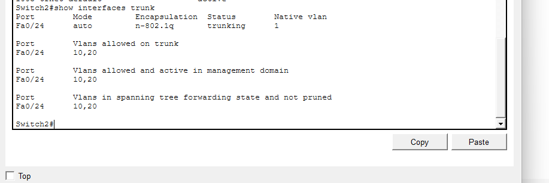

## Overview
This lab demonstrates inter-VLAN routing using the router-on-a-stick method. Two VLANs (HR and IT) are configured across two switches with a trunk link, and a router provides routing between VLANs using subinterfaces and 802.1Q tagging.

## Topology

## VLANs
### Switch1 VLANs

### Switch2 VLANs

## Trunking
### Switch1 Trunk

### Switch2 Trunk

## Router Configuration
### Router Interfaces

## Connectivity Test
### Inter-VLAN Ping Success

## Skills Demonstrated
- VLAN creation and port assignment
- Trunking (802.1Q)
- Router-on-a-stick subinterfaces
- Inter-VLAN routing
- Connectivity testing and troubleshooting

## Troubleshooting
### Issue:
Devices could not ping across VLANs.

### Cause:
Trunk link was not allowing VLAN 10 and 20.

### Fix:
Configured allowed VLANs on trunk ports using: switchport trunk allowed vlan 10,20
